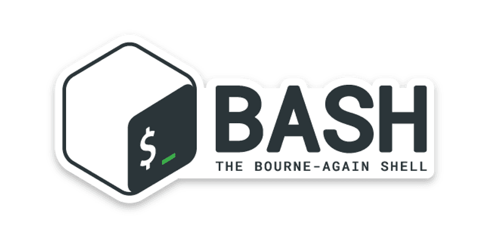

<div id="top"></div>


<!-- PROJECT LOGO -->
<br />
<div align="center">
  <a href="https://github.com/othneildrew/Best-README-Template">
    
  </a>
  <h3 align="center">Easy DBMS</h3>
  <p align="center">
    DBMS Shell-Script Project for ITI Bash-script Course
    <br />
</div>


<!-- TABLE OF CONTENTS -->
<details>
  <summary>Table of Contents</summary>
  <ol>
    <li>
      <a href="#about-the-project">About The Project</a>
      <ul>
        <li><a href="#built-with">Hints</a></li>
      </ul>
    </li>
    <li>
      <ul>
        <li><a href="#prerequisites">The Project Features</a></li>
      </ul>
    </li>
    <li><a href="#contributing">Contributing</a></li>
    <li><a href="#license">License</a></li>
    <li><a href="#contact">Contributers Names</a></li>
  </ol>
</details>


<!-- ABOUT THE PROJECT -->
## About The Project

Bash Shell Script Database Management System (DBMS):

The Project aim to develop DBMS, that will enable users to store and retrieve the data from Hard-disk.


Use the `BLANK_README.md` to get started.

<p align="right">(<a href="#top">back to top</a>)</p>


### Hints:

- The Database will store as Directory on Current Script File
- The Select of Rows displayed in screen/terminal in  an Accepted/Good Format
- Ask about columns datatypes in create table and check on them in both insert and update
-Ask about primary key in create table and check for it in the insert into table


* [Bash-Script]

<p align="right">(<a href="#top">back to top</a>)</p>


<!-- GETTING STARTED -->
## Getting Started

- You should have a linux operating system 
- Open your terminal then excute
  ```sh
  ./main.sh
  ```

<!-- USAGE EXAMPLES -->
## The Project Features:

The Application will be CLI Menu based app, that will provide to user this Menu items:
Main Menu:
- Create Database
- List Databases
- Connect To Databases
- Drop Database

Upon user Connect to Specific Database, there will be new Screen with this Menu:
- Create Table 
- List Tables
- Drop Table
- Insert into Table
- Select From Table
- Delete From Table
- Update Table

<!-- CONTRIBUTING -->
## Contributing

Contributions are what make the open source community such an amazing place to learn, inspire, and create. Any contributions you make are **greatly appreciated**.

If you have a suggestion that would make this better, please fork the repo and create a pull request. You can also simply open an issue with the tag "enhancement".
Don't forget to give the project a star! Thanks again!

1. Fork the Project
2. Create your Feature Branch (`git checkout -b feature/AmazingFeature`)
3. Commit your Changes (`git commit -m 'Add some AmazingFeature'`)
4. Push to the Branch (`git push origin feature/AmazingFeature`)
5. Open a Pull Request


<!-- LICENSE -->
## License

Distributed under the ITI License. See `LICENSE.txt` for more information.

<p align="right">(<a href="#top">back to top</a>)</p>

<!-- CONTACT -->
## Contributers Names

[Fathi Yehya]
[Hani Mohsen]
[Mohamed Ali]

<p align="right">(<a href="#top">back to top</a>)</p>

[product-screenshot]: images/screenshot.jpeg
